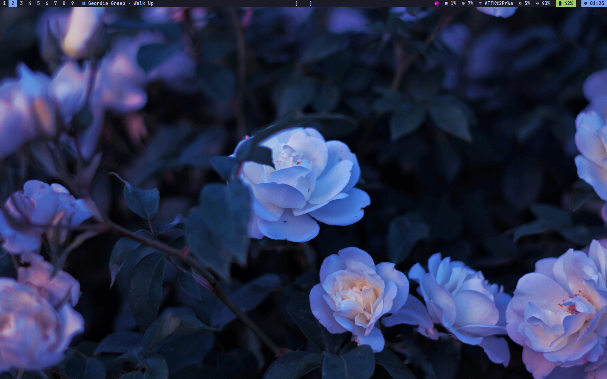
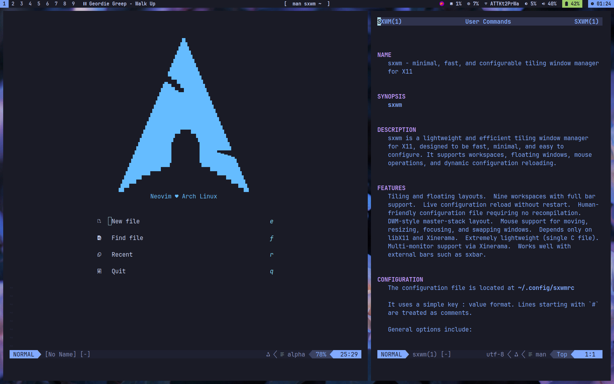

<br />
<div align="center">
  <a href="https://github.com/drem-jpg/dots">
    
    
  </a>

  <h3 align="center">dots</h3>

  <p align="center">
    my dotfiles for <a href="https://github.com/uint23/sxwm"><strong>sxwm</strong></a>
  </p>
</div>

### installation
1. install gnu stow for your distro
2. clone the repo
   ```sh
   git clone https://github.com/drem-jpg/dots.git
   ```
3. cd into repo
   ```sh
   cd dots
   ```
4. use stow to create symlinks
   ```sh
   stow .
   ```
